# A Primer for Writers of Ages

  

> *An Age answers only what you have written — and what the book supplies where you left silence. Secure a way home before you touch the panel.*

This is an Archivist’s primer to **The Art** as practised in Mystcraft Reborn: you **learn symbols**, **write Descriptive Books**, and **link** into Ages — worlds shaped by your pages and by what the book discovers on first travel. Wonder waits on the far side of the ink. So do haste’s consequences.

Install notes and versions are in the [project README](../../README.md). Inspired by the spirit of *Myst* and classic Mystcraft; not affiliated with or endorsed by Cyan Worlds. This guide describes Mystcraft Reborn alone.

---

## Key terms

- **Age** — a Mystcraft-generated world (its own dimension). A Descriptive Book creates and links into one on first travel.

- **Descriptive Book** — the book that writes an Age and takes you there. Bound at the [Book Binder](#book-binder) from a Link Panel and pages.

- **Linking Book** — returns you to the place where it was bound. Made by using an [Unlinked Link Book](#unlinked-link-book) in the world.

- **Symbol page** — a single glyph (one symbol, plus any modifiers). Consuming a new page teaches it — see [Pages, symbols, and knowledge](#pages-symbols-and-knowledge).

- **Link Panel** — the linking page for a book. Made at the [Ink Mixer](#ink-mixer), not in a crafting table.

- **Star Fissure** — a natural return near the origin of some Ages. See [Linking in the world](#linking-in-the-world).

---

## Your first Age

The first linking is a rite of passage. Gather glyphs, bind a [Descriptive Book](#descriptive-book), and — before you go — bind a [Linking Book](#linking-book) so the path home exists when you need it.

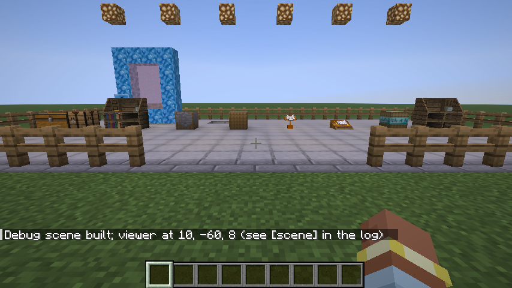

1. **Find a [symbol page](#symbol-page)** — loot chests, **Libraries** in Ages, **Archivist** villagers, or open a **Sealed Notebook**.
2. **Study it** — use the page in hand. **Consuming it teaches you its symbol** (and any modifiers on it). If you already knew that symbol, the page is not consumed.
3. **Craft a [Writing Desk](#recipe-writing-desk)**, [Collation Folder](#recipe-collation-folder), [Ink Vial](#recipe-ink-vial), [Ink Mixer](#recipe-ink-mixer), and [Book Binder](#recipe-book-binder) (recipes below).
4. At the [desk](#writing-desk), write known symbols into a [folder](#collation-folder) (needs paper and ink). Attach modifiers where the desk allows them.
5. At the [Ink Mixer](#ink-mixer), make a [Link Panel](#link-panel) (ink + optional link-effect ingredients + paper).
6. At the [Book Binder](#book-binder), bind a [Descriptive Book](#descriptive-book) — the book that creates and links to an [Age](#age) — from the Link Panel and your pages. Name it if you like.
7. **Have a way home** before you go — craft an [Unlinked Link Book](#unlinked-link-book) (Link Panel + leather), use it where you stand to bind a [Linking Book](#linking-book), and keep that book safe. Some Ages also generate a [Star Fissure](#star-fissure) near the origin. [Vault](#vault-ages-and-the-facility) Ages reward a Linking Book inside the Facility.
8. **Link** with the Descriptive Book to enter its [Age](#age). The first link finishes the world: categories you left blank are filled in, and new pages appear as *discovered*.

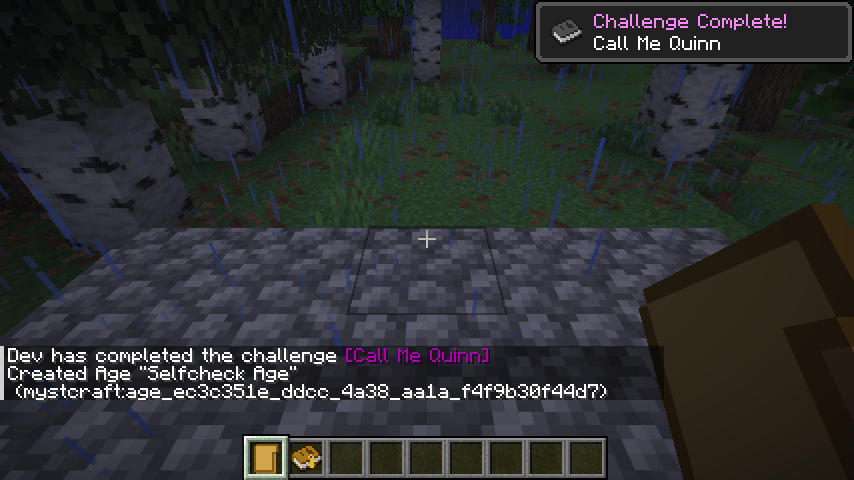

---

## Recipes

The materials of The Art are ordinary enough until they are joined. Crafted in a crafting table unless noted.

<h3 id="recipe-writing-desk">Writing Desk</h3>

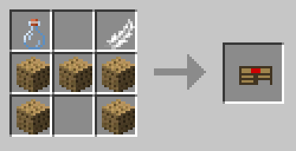

1 Glass Bottle, 1 Feather, 5 Planks (any wood). Places as the whole desk, backboard and shelves included.

<h3 id="recipe-collation-folder">Collation Folder</h3>

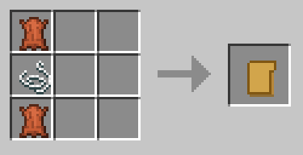

2 Leather with 1 String between them (one column).

<h3 id="recipe-ink-vial">Ink Vial</h3>

Shapeless craft (crafting table), two ways — 2× Black Dye + Water Bottle, or 2× Black Dye + Glass Bottle + Water Bucket:

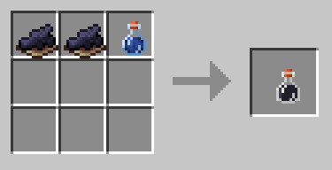 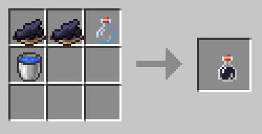

You can also fill a glass bottle from black ink fluid in the world.

<h3 id="recipe-ink-mixer">Ink Mixer</h3>

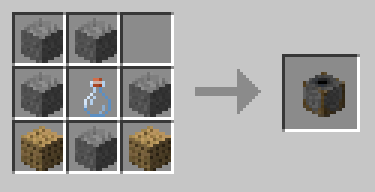

5 Stone, 1 Glass Bottle (centre), 2 Planks (bottom corners).

<h3 id="recipe-book-binder">Book Binder</h3>

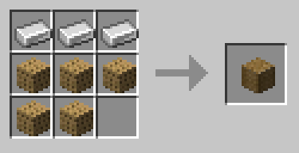

3 Iron Ingots (top row), 5 Planks.

### Bookstand

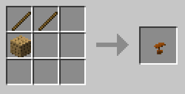

2 Sticks over 1 Planks.

### Lectern

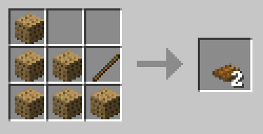

6 Planks and 1 Stick (makes 2).

### Book Receptacle

Needs **Crystal** from world generation (Crystal Formations and similar):

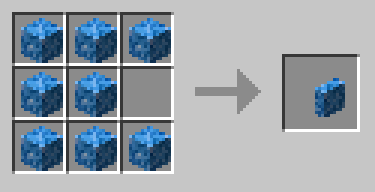

8 Crystal in a ring.

<h3 id="unlinked-link-book">Unlinked Link Book</h3>

Custom shapeless recipe (not the vanilla book recipe) — **1 Link Panel + 1 Leather** anywhere in the grid:

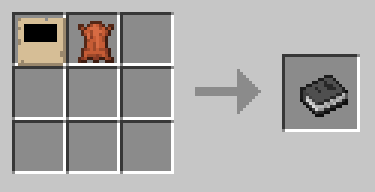

Use it in the world to bind a [Linking Book](#linking-book) to that spot.

### Link Panel

Not crafted in a crafting table — produced at the [Ink Mixer](#ink-mixer).

### Not crafted in survival

| Item | How you get it |
|---|---|
| Crystal | Generated in Ages with crystal features |
| Scholar's Writing Desk | Creative mode — knows every symbol |
| Link Modifier | No survival recipe yet (creative / debug) |
| Facility blocks | Only inside Vault Facilities |
| Link Panel | ([Ink Mixer](#ink-mixer)) |
| Descriptive Book | ([Book Binder](#book-binder)) |
| Linking Book | (use [Unlinked Link Book](#unlinked-link-book) in the world) |

---

## Workstations

These are the tools of The Art: the desk for glyphs, the mixer for the panel’s temperament, the binder for the finished book.

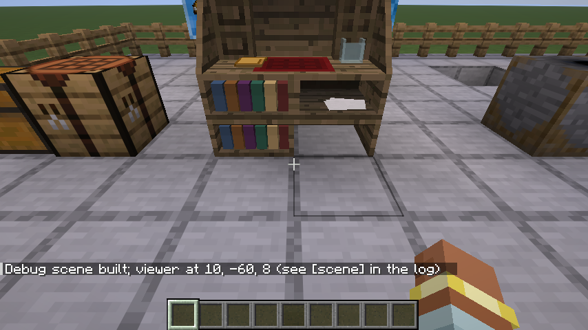

<h3 id="writing-desk">Writing Desk</h3>

Browse symbols you know by category, write copies into a **Collation Folder**, and attach modifiers the symbol accepts. Costs paper and ink. The desk refuses incompatible modifiers.

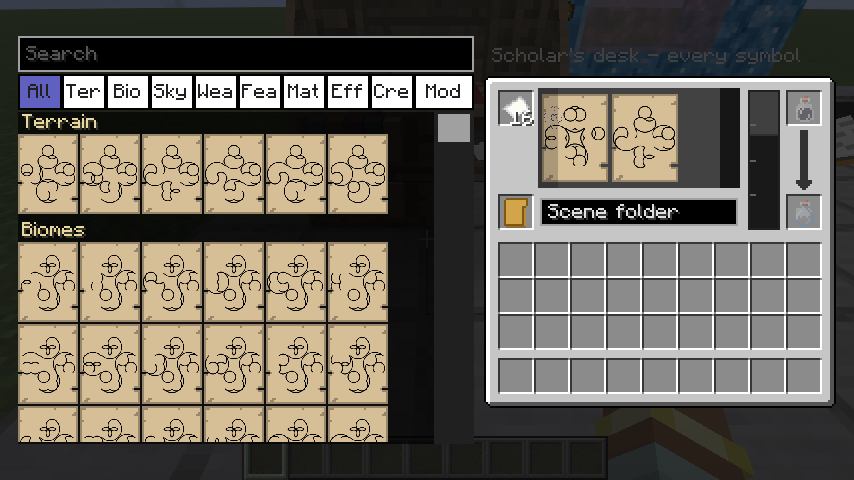

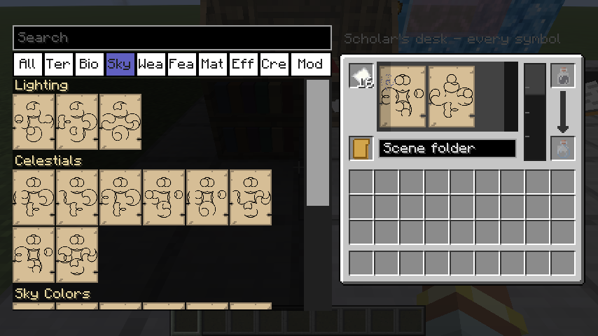

<h3 id="ink-mixer">Ink Mixer</h3>

Ink alone opens the way. Ingredients tune *how* the link behaves — choose them with care.

1. Pour **Ink** (vial or bucket) into the mixer.
2. Click the basin while holding an ingredient to switch on **one link effect** per ingredient (see table below).
3. Insert **paper** to pull out a [Link Panel](#link-panel) with those effects.
4. Refilling ink clears effects. **Black Dye** clears the basin without pouring more ink.

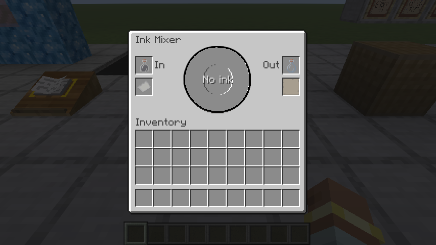

**Default ink ingredients** (packs may change these in config):

| Ingredient | Effect | What it does |
|---|---|---|
| Clay Ball | Generate Platform | Small platform under the arrival point |
| Feather | Maintain Momentum | Keep your speed through the link |
| Gunpowder | Disarm | Items stay behind; you arrive empty-handed |
| Compass | Intra-Linking Only | Book only works inside its dimension |
| Ender Pearl | Intra-Linking | Book can also link within the same dimension |
| Amethyst Shard | Relative Link | Arrival keeps position relative to departure |
| Ender Eye | Following | The book comes with you instead of staying behind |
| Black Dye | *(clear)* | Removes all effects from the basin |

<h3 id="book-binder">Book Binder</h3>

Put in a [Link Panel](#link-panel) and written pages (from a folder or inventory). Optional title. Output: a [Descriptive Book](#descriptive-book) ready to link.

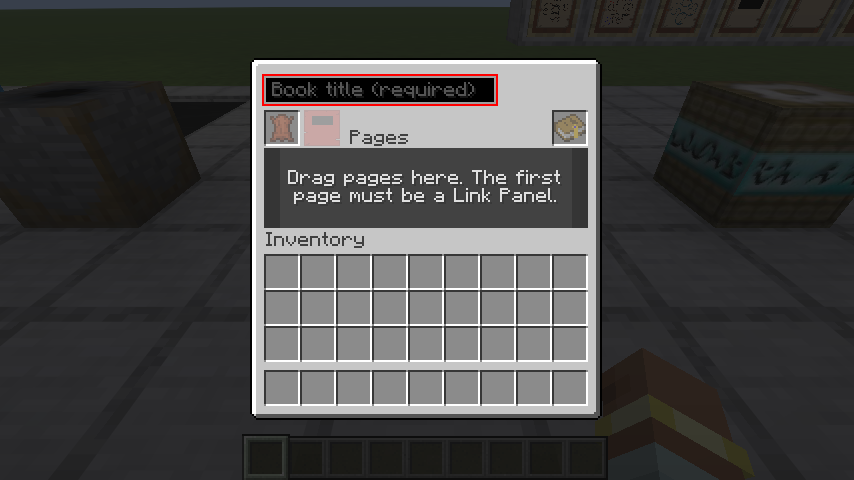

<h3 id="collation-folder">Collation Folder</h3>

Holds pages while you write and sort. Open it to manage its contents.

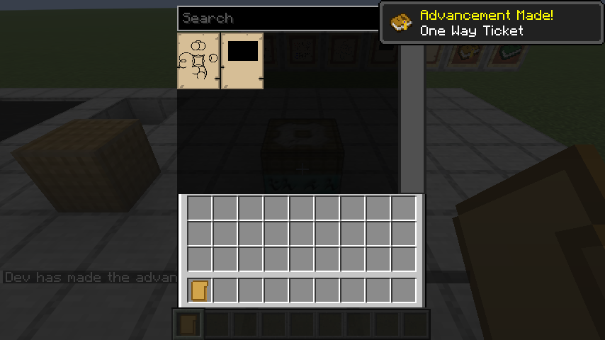

---

## Pages, symbols, and knowledge

A **page** is a single glyph of The Art — one symbol, and any modifiers it will bear. **Knowledge** is yours alone: it survives death, and the desk will write only what you have already learned (save creative play and the Scholar’s desk).

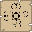

**How you learn**

- Use a symbol page in hand — **consuming it teaches its symbol** (if new).
- Visit an Age — you learn every symbol written in that Age's book.
- Write only symbols you already know (except creative / Scholar's desk).

**How pages reach you**

- **Sealed Notebook** — open for a mix of pages by rarity (common through rare).
- **Library** — small structure in Ages; chest loot (often notebooks) and lecterns with rarer symbol pages.
- **Archivist** villager — trades blank pages, Link Panels, and Sealed Notebooks; also a small page shop (emerald prices scale with symbol rarity; notebooks cost more). Writing Desks can appear in Archivist houses when village generation allows it.

### Symbol categories

When you write an Age, pages fall into categories. On first link, anything you left empty may be filled automatically — the Age finishing what you left unsaid, in a different ink.

| Category | Role |
|---|---|
| Terrain | Shape of the land — required, exactly one |
| Biome Layout | How biomes are arranged — required, exactly one |
| Biomes | Which biomes appear — required unless layout is Native |
| Lighting | Overall light — required, exactly one |
| Celestials | Suns, moons, stars — need at least one sun |
| Sky / World Colors | Optional colour pages |
| Weather | Optional |
| Structures | Villages, fortresses, Vault, etc. — optional |
| Terrain Features | Caves, lakes, islands, Star Fissure, … — optional |
| Effects | Environmental hazards — optional |
| Creatures | Spawn groups — optional |
| Materials / Modifiers | Attach to compatible pages (not free-standing “terrain material” pages) |

**Gates to remember:** Nether biomes / fortresses need Nether terrain; End biomes need End terrain; a Single biome layout wants exactly one biome page.

Discovered pages (added on first link) show in a different ink and are sorted into the book by category.

---

## Linking in the world

A [Descriptive Book](#descriptive-book) takes you *to* an [Age](#age). A [Linking Book](#linking-book) returns you to the place where it was bound. Touch the panel — by hand, stand, lectern, or crystal frame — and the written place answers.

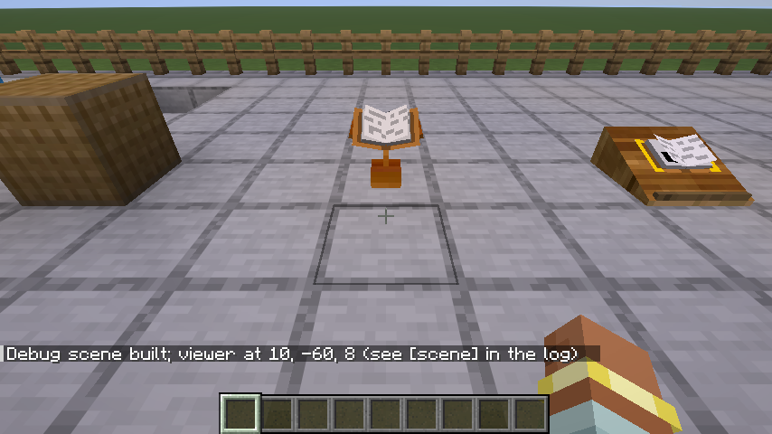

| Method | Notes |
|---|---|
| Use a book | Descriptive Book → Age; Linking Book → bound location |
| Bookstand / Lectern | Place a book; use the stand to link. The bound book stays |
| Link Portal | Frame of **Crystal** around a **Book Receptacle** holding a book. An unbound book binds on first contact |
| Star Fissure | Natural return near the origin of some Ages |

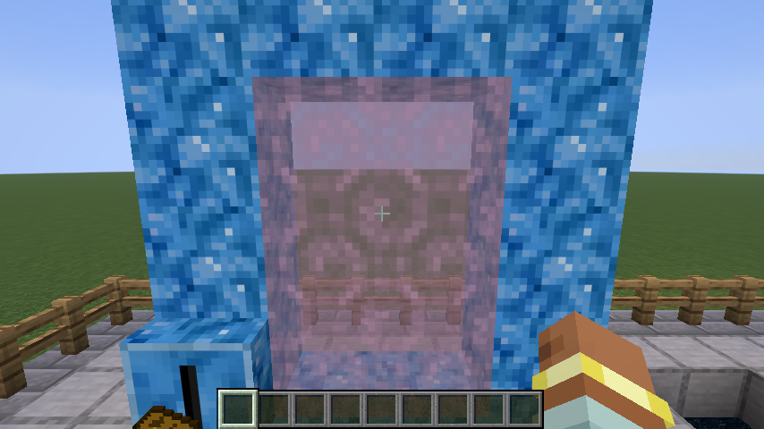

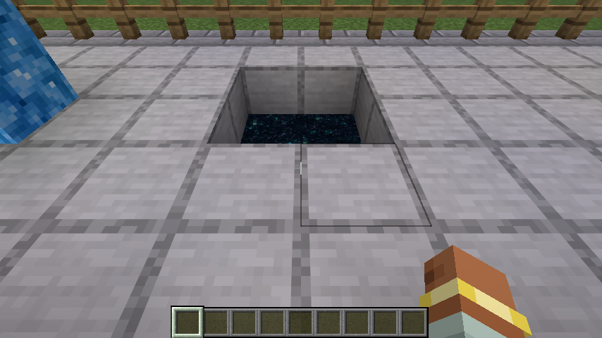

Link effects on the panel (from the Ink Mixer) change how travel behaves — platforms, relative position, whether the book follows you, and so on. Read the tooltips; **Disarm** and **Intra-Linking Only** are easy to set by mistake.

---

## Ages and instability

Each Age is its own sky and its own clock — weather, light, and law drawn from its pages. Write with coherence. Contradiction and stacked hazard raise **instability**: potion effects, crumbling stone, coloured **decay**, lightning, meteors, and worse as the Age unravels.

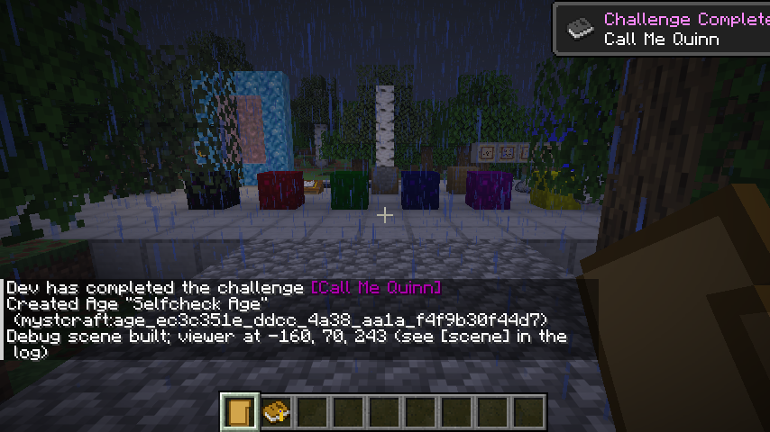

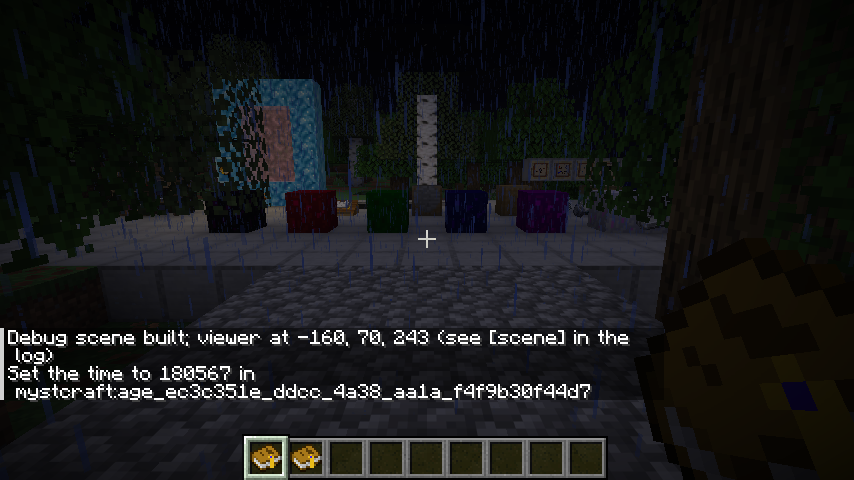

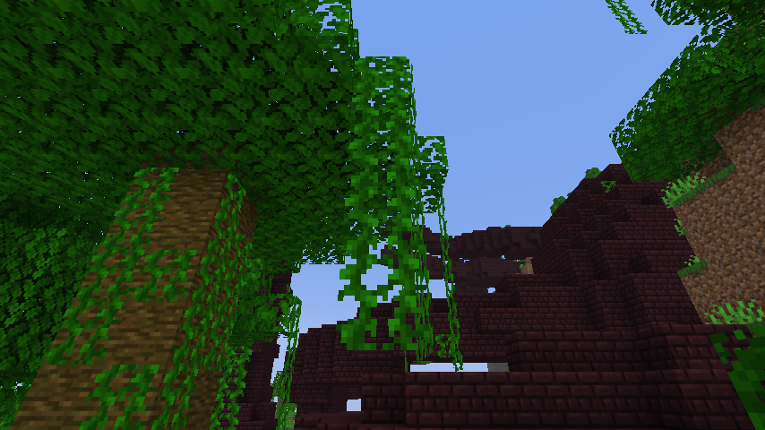

You do not need the score math — write coherent Ages, avoid stacking every hazard, and treat “discovered” chaos as a reason to pack carefully.

---

## Vault Ages and the Facility

Write the **Vault** structure symbol into an Age (or discover it). Near spawn you will find a **Facility**: a sealed complex left in that world — rooms, locks, and wards until the work is finished.

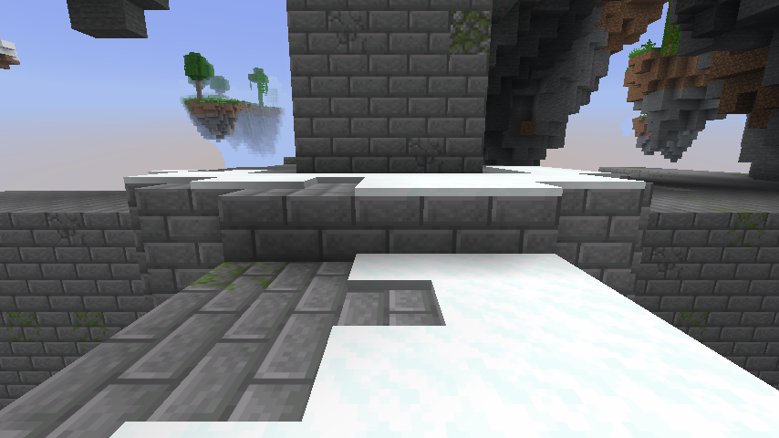

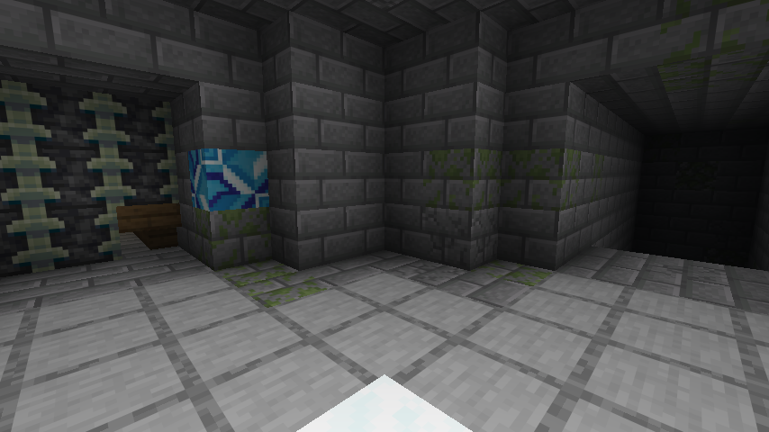

Expect puzzles and defenses such as:

- **Symbol Altars** — offer pages of symbols from *this* Age
- **Sequence Dials** — match the Age's glyph code (clue blocks help)
- **Offering Pedestals**
- Trial spawners and vault loot

The terminal **Facility Cache** gives each player a **Linking Book home**. Until someone claims that reward, the Facility's warded blocks cannot be broken. Bring pages, gear, and a backup way out if you can.

---

## Advancements

Milestones along the path — wry titles for hard-earned lessons.

| Advancement | Goal |
|---|---|
| **Small Step of the Journey** | Find a symbol |
| **The Art: A Primer** | Copy a symbol at a desk |
| **One Way Ticket** | Craft a Descriptive Book (remember: one way without a Linking Book) |
| **Tie a String** | Craft an Unlinked / Linking Book |
| **The Way Back** | Travel while carrying a Linking Book |
| **Call Me Quinn** *(hidden)* | Travel to a dimension without a Linking Book |

---

## Counsel for writers

- **Always bind a Linking Book** (or know a Fissure / Facility plan) before your first Descriptive Book link.
- Leaving categories blank is fine — the Age will fill them and teach you what it picked.
- Match terrain to biomes and structures (Nether / End gates).
- Use a **Scholar's Writing Desk** in creative to practice full symbol sets without grinding pages.
- Portals need Crystal — explore Ages that generate formations, or trade/loot your way into pages that lead there.
- Folders and desks make iterating faster than rewriting from loose pages alone.

Write carefully. Link with a way home in hand. The Ages will do the rest.

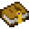  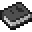   
